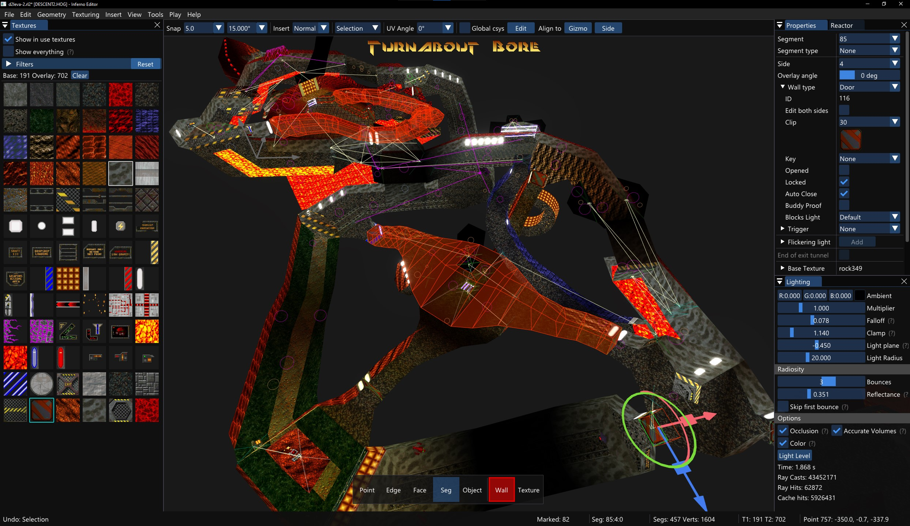

# Inferno Editor
The Inferno Editor is a modern level editor for Descent 1 and 2 designed for efficiency and ease of use. Inspired by Blender and UnrealEd.

## Features
- Interactive extrusion, translation, rotation, and scaling
- Entirely new radiosity light model with support for per-side settings
- Real-time renderer that animates powerups, scrolling textures and flickering lights
- Quickly mark and edit geometry using the mouse and various selection tools
- Copy marked segments and their contents along with support for mirroring
- Edit multiple objects at once. Supports copying and transforming across segments.
- Shows connections between triggers and their targets

## System Requirements
- Windows 10 64-bit
- DirectX 12 capable GPU
- A retail copy of either Descent 1 or Descent 2

## User Guide
On first start the editor will ask to locate the Descent 1 or Descent 2 executables. It uses their folders to locate game data. 
These are also used when starting the game from the 'Play' menu.

There is a user guide in the help menu.

# Building
Requires Visual Studio 2022 with VCPKG integration

Restore git submodules. Open `Inferno.sln` file and build. If set up correctly dependencies will be fetched automatically using the VCPKG manifest.
